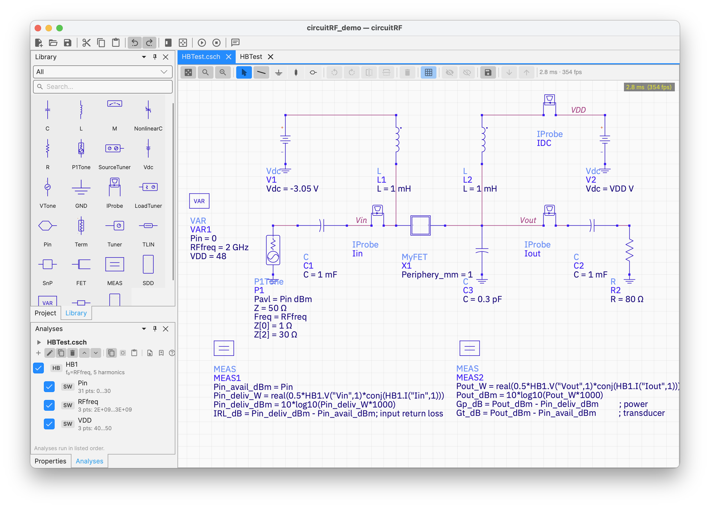
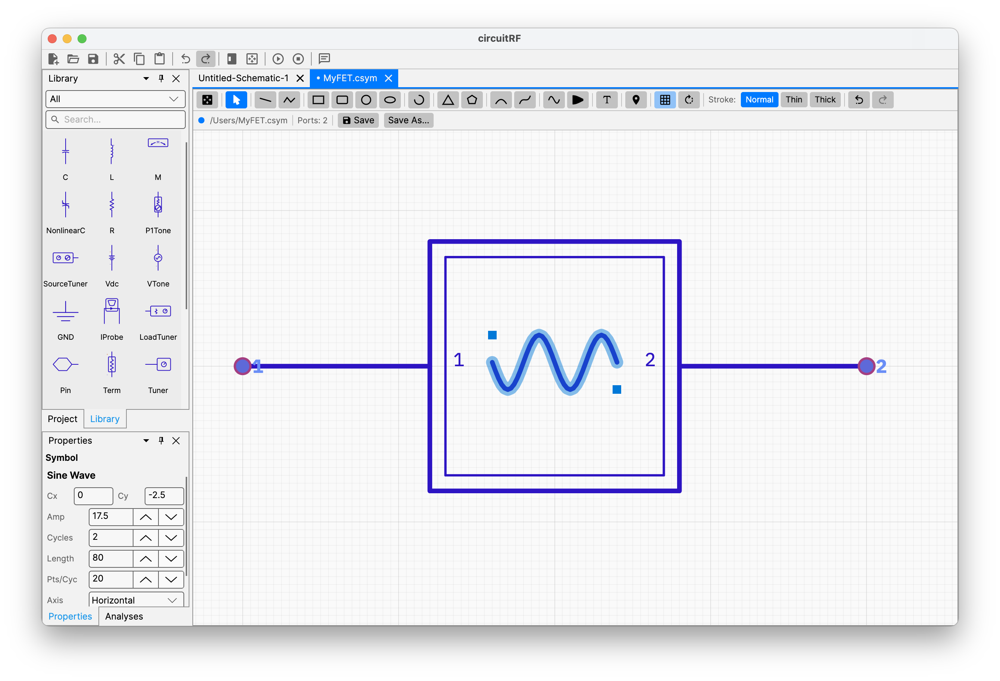
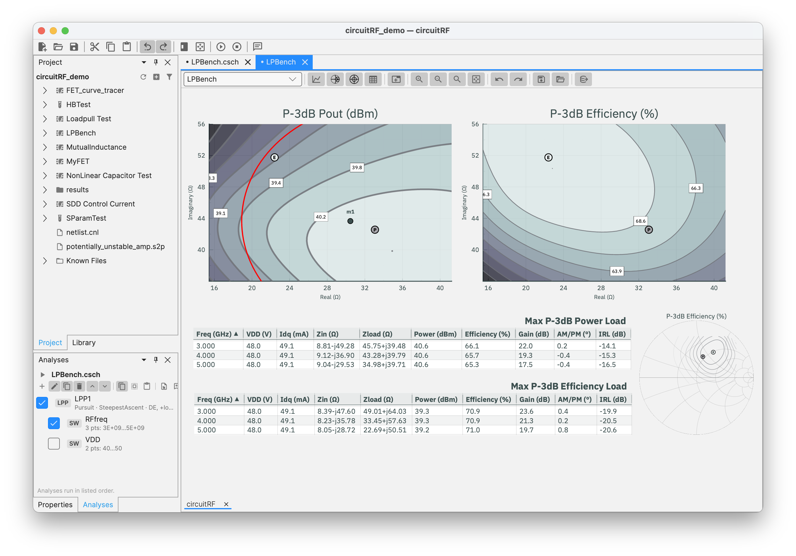
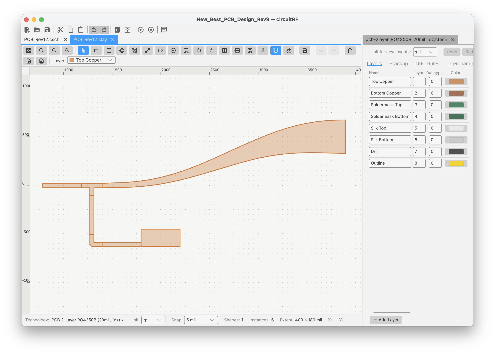

# circuitRF

**A lightweight, cross-platform RF circuit simulator — for the RF community, by the RF community.**

[](LICENSE)
[](https://dotnet.microsoft.com/)
[](#getting-started)
[](https://avaloniaui.net/)

circuitRF is an EDA tool for developing RF circuits.  It can analyze the frequency response and nonlinear behavior of RF circuits — from a handful of components to hierarchical, multi-port designs with thousands of components — using **DC**, **S-parameter**, and **harmonic-balance** analyses, plus first-class **loadpull / sourcepull**. The analyses and the workflow are built around the RF/microwave problem, the file formats are human-readable, and the headline goal is to make loadpull as easy as a few clicks. circuitRF also includes a **layout editor** for PCB and MMIC design — with substrate-aware microstrip components, schematic↔layout generation, and full two-way interchange with **Gerber + Excellon**, **GDSII**, **DXF** and `.kicad_pcb` board files — read, written, and convertible in any direction, from the GUI or from command line user `circuitrf convert` — and a **2.5D electromagnetic solver** that analyses that layout geometry using its substrate stackup.

circuitRF is for RF practitioners or researchers who can't justify the cost of traditional tools (or find those tools too heavy for a quick investigation): **power-amplifier, LNA, and mixer designers; RF EDA and device-modeling engineers; academic researchers; and capable hobbyists.** It is written in **C# / .NET 10**, with an **Avalonia 12** GUI rendered through **SkiaSharp**, and it was built largely **AI-assisted** (see
[AI-assisted development](#ai-assisted-development)).

> **Status:** v1 *beta*.
> ([Roadmap & status](#roadmap--status)). Expect rough edges, and please file issues.

---

## Screenshots

### Schematic editor

<!-- IMAGE TO CREATE: docs/images/schematic-editor.png
     The schematic editor showing a single-FET power amplifier (Hero 2): an SDD FET with gate/drain bias
     (Vdc sources), input and output matching networks (R/L/C), a P1Tone RF source on the left, a Term on
     the output. Left: the Library Palette with component glyph tiles. Right/bottom: the Analyses panel
     with an HB power sweep set up. Show a couple of net labels and the green junction dots so the wiring
     reads clearly. -->
*Build hierarchical RF circuits on a virtualized canvas: drag from the palette, wire, label nets, set
parameters and sweeps, and Run.*

### Symbol editor

<!-- IMAGE TO CREATE: docs/images/symbol-editor.png
     The symbol editor with a custom cell symbol in progress — e.g. a two-port amplifier block: a body
     rectangle, a few drawing primitives (lines/arc/text label), and two pins snapped to the connection
     grid with their port numbers shown. Left toolbar: the drawing tools (line, rect, circle, arc, text,
     pin). Show the fine authoring grid. -->
*Draw the glyph for any cell and place its connection pins — the same renderer the schematic uses.*

### Data Display — loadpull contours

<!-- IMAGE TO CREATE: docs/images/data-display-loadpull-contour.png
     The Data Display showing a loadpull result on a Smith chart: Pout (dBm) and PAE (%) contours over the
     load-Γ plane, with the MXP (max power) and MXE (max efficiency) markers called out, and a couple of
     interactive markers reading off impedance/value. A trace inspector card on the right shows the
     metric/colormap selection. Optionally a second rectangular plot (power sweep) docked alongside. -->
*Plot S-parameters, spectra, power sweeps, and loadpull contours; overlay measured Touchstone/`.spl`/
`.lpcwave` data on simulated results.*

### Layout editor

<!-- IMAGE PLACEHOLDER: docs/images/layout-editor.png — to be supplied by the repo owner. -->
*Draw and edit physical geometry on a technology-defined layer stack: microstrip components generated from
their schematic parameters, hierarchy with arrays, and export to GDSII, DXF and Gerber.*

---

## Download

These install for you alone, need no administrator rights, and update themselves in the background.

> **While circuitRF is in beta, tick *Settings ▸ Security & Permissions ▸ Include beta releases*.**
> Beta versions are published as GitHub pre-releases, and that box is what puts them on your update
> channel — without it you stay on the version you installed until the first stable release.

| Platform | Download |
|---|---|
| Windows, Intel/AMD | [circuitRF-1.0.0-beta.17-win-x64-user.msi](https://github.com/potatobeanradio/circuitRF/releases/download/1.0.0-beta.17/circuitRF-1.0.0-beta.17-win-x64-user.msi) |
| Windows, ARM | [circuitRF-1.0.0-beta.17-win-arm64-user.msi](https://github.com/potatobeanradio/circuitRF/releases/download/1.0.0-beta.17/circuitRF-1.0.0-beta.17-win-arm64-user.msi) |
| Windows, 32-bit | [circuitRF-1.0.0-beta.17-win-x86-user.msi](https://github.com/potatobeanradio/circuitRF/releases/download/1.0.0-beta.17/circuitRF-1.0.0-beta.17-win-x86-user.msi) |
|  |  |
| macOS, Apple Silicon | [circuitRF-1.0.0-beta.17-arm64.dmg](https://github.com/potatobeanradio/circuitRF/releases/download/1.0.0-beta.17/circuitRF-1.0.0-beta.17-arm64.dmg) |
| macOS, Intel | [circuitRF-1.0.0-beta.17-x64.dmg](https://github.com/potatobeanradio/circuitRF/releases/download/1.0.0-beta.17/circuitRF-1.0.0-beta.17-x64.dmg) |
|  |  |
| Linux, Intel/AMD | [circuitRF-1.0.0-beta.17-linux-x64.tar.gz](https://github.com/potatobeanradio/circuitRF/releases/download/1.0.0-beta.17/circuitRF-1.0.0-beta.17-linux-x64.tar.gz) |
| Linux, ARM | [circuitRF-1.0.0-beta.17-linux-arm64.tar.gz](https://github.com/potatobeanradio/circuitRF/releases/download/1.0.0-beta.17/circuitRF-1.0.0-beta.17-linux-arm64.tar.gz) |


**Linux** — unpack and run `install.sh`. It writes only inside `~/.local`, puts `circuitrf` on your PATH
and registers the menu entry and file types; `--uninstall` removes it and leaves your work alone.

```sh
tar xzf circuitRF-1.0.0-beta.17-linux-x64.tar.gz
./circuitRF-1.0.0-beta.17/install.sh
```

**Installing for everyone on the machine?** The Windows `.msi` files without `-user`, and the `.deb`
files, are on the [releases page](https://github.com/potatobeanradio/circuitRF/releases). They need
administrator rights, so they cannot update themselves — they tell you when a new version is out
instead.

Automatic updates can be turned off in **Settings ▸ Security & Permissions**. Building the installers
yourself: [BUILDING.md](BUILDING.md).

---

## Contributors are welcome — *especially RF domain experts*

circuitRF is meant to be **community-driven, by and for the RF engineering community.** We value **RF
domain knowledge as much as software experience.** If you design power amplifiers, LNAs, or mixers; build
RF EDA tooling; do device modeling; or develop transistor technology (GaN-on-SiC, GaN-on-Si, LDMOS, …),
**you are exactly who this project needs** — and circuitRF is a great place to use AI to build the
simulation features *you* want.

You do **not** need to be a professional software developer. If you've scripted in MATLAB or Python, you
have enough to start. Pair yourself with [Claude Code](https://www.anthropic.com/claude-code) (or your
AI assistant of choice) and let it do the heavy lifting on the C#.

---

## Architecture

circuitRF is built in **strictly one-directional layers** — dependencies point **up the stack only**, and
nothing below the UI knows the UI exists. This is what keeps the simulator (the actual value of the
product) independent of any GUI framework. Full detail:
[`docs/design/ui-architecture.md`](docs/design/ui-architecture.md).

```
  src/RfCore              shared result/network library: Touchstone I/O, S/Z/Y math,
        ▲                  the DataSet/DataCube result model, loadpull readers/writers
        │
  src/Core      Design + Elaboration: cells, instances, nets, parameters, the expression
        ▲        engine; flatten + resolve → an "elaborated netlist".  No UI, no numerics.
        │
  src/Engine    Numeric layer: sparse MNA, DC, S-parameters, harmonic balance, loadpull,
        ▲        and the planar method-of-moments EM kernel.  Consumes the elaborated
        │        netlist, produces a DataSet.  No UI.
        │
  src/Design    Design-layer DOCUMENTS: the layout model and .clay reader, the technology/
        ▲        stackup model and .ctech reader, the .ccell cell folder, the .cem EM setup and
        │        its extractors, the interchange readers/writers, the DRC engine, and — since
        │        2026-09 — the .csch/.csym schematic and symbol model with net extraction, plus
        │        the functions that CREATE a workspace, a cell and an imported part.  No UI:
        │        it draws nothing and docks nothing; the EDITORS all stay in src/Ui.
        │
  src/Render    The Skia RENDERERS: schematic, symbol, layout and bondwire, their themes and
        ▲        caches, the colour-theme model and .ccolor reader, and the overlay descriptions
        │        of a frame's transient chrome.  SkiaSharp only — pixels out, and nothing in.
        │        Referenced by BOTH src/Ui and src/Cli, so there is exactly one renderer.
        │
  src/Ui        Presentation: Avalonia 12 + SkiaSharp. Schematic/symbol/layout editors,
                 Data Display, workspace. Depends on everything above. Nothing depends on it.

  src/Diagnostics  The coded-diagnostic leaf: an id, typed arguments and an English template.
                 Referenced by every layer that authors user-facing text, including RfCore and
                 WBond, which have no common ancestor.  No UI.

  src/Harmonica  harmonicaRF's framework-free half — interactive harmonic loadpull on one
  src/WBond      wBond's framework-free half — bondwire geometry + its own 3D MoM kernel
                 Both also ship as standalone apps: src/Ui with a different Main().

  src/Cli       Headless driver — depends on Core/Engine/RfCore/Design, NOT on src/Ui. Proof
                 the engines are fully usable with no GUI; the engines' primary test harness.
                 Verbs: sparam, dc, hb, lp, lpp, em, elab, convert, new, import, check,
                 explain, read, serve.  See docs/user/reference/cli.html.
```

### The three layers (design → elaboration → numeric)

1. **Design layer** (`src/Core`) — what you edit: **cells** (each with Symbol / Schematic / Layout views),
   instances, nets, **parameters** (hierarchical, with overrides), global variables, and a **TestBench**
   (the thing you simulate — top cell + analyses + measurements). Serialized to **human-readable** files
   (`.cnl` netlist, JSON).
2. **Elaboration layer** (`src/Core`) — flattens the hierarchy, resolves every parameter and expression
   **top-down** (with mandatory **cycle detection**), and numbers the nodes → an *elaborated netlist*.
   This is the single thing the engine consumes, whether it came from a hand-written `.cnl` or from the
   schematic editor's **net extractor**.
3. **Numeric layer** (`src/Engine`) — matrices, unknown vectors, and analyses. It never sees a domain
   object or an unresolved expression. Every run returns a **`DataSet`**: a named collection of
   **`DataCube`s**, each a labeled, unit-bearing, N-D array of a single kind (Real **or** Complex).

One **expression engine** (tokenize → Pratt-parse → AST → evaluate; never string substitution) serves
global variables, cell parameters, the SDD's device equations, and measurements
([`docs/design/expressions.md`](docs/design/expressions.md)).

### The engines (`src/Engine`)

- **Linear / S-parameters** — complex **sparse MNA** (CSparse.NET) over a frequency sweep, with
  renormalization and Touchstone (`.sNp`) blocks with interpolation.
  ([`docs/design/linear-engine.md`](docs/design/linear-engine.md))
- **Nonlinear DC** — Newton–Raphson with gmin/source stepping; diode, FET, BJT, and the **SDD**
  (Symbolically-Defined Device: you write `i = f(v)` and exact Jacobians come from **forward-mode
  automatic differentiation**). ([`docs/design/nonlinear-dc.md`](docs/design/nonlinear-dc.md),
  [`docs/design/sdd.md`](docs/design/sdd.md))
- **Harmonic balance** — multidimensional Newton with a conversion-matrix Jacobian, a clean
  linear/nonlinear partition, **single- and two-tone** (diamond truncation, mixing order ≥ 5), and
  power-step continuation for convergence at drive.
  ([`docs/design/harmonic-balance.md`](docs/design/harmonic-balance.md))
- **Loadpull / sourcepull** — the headline differentiator: sweep source/load Γ over a Smith-chart grid,
  run HB per point, and report FOMs (Pout, gain, efficiency, PAE) as contours. Includes a **pursuit**
  engine and a post-processor that derives the display metrics measured files carry.
  ([`docs/design/loadpull.md`](docs/design/loadpull.md),
  [`docs/design/loadpull-contours.md`](docs/design/loadpull-contours.md))
- **Electromagnetic (`src/Engine/Mom`)** — two kernels behind one registry: a **quasi-static
  cross-section** solver for uniform lines (Z₀, ε_eff, loss, RLGC) and a **full-wave planar
  method-of-moments** solver over a layered Green's function, with meshing, ports, de-embedding,
  adaptive frequency sampling and an AIM accelerator. Fed by `src/Design`'s extractors, driven by the
  GUI's EM Setup panel *or* by `circuitrf em`. ([`docs/design/mom-engine.md`](docs/design/mom-engine.md))

### How rendering works — SkiaSharp and Avalonia

The GUI is **Avalonia 12** (the cross-platform .NET UI framework — same window/menu/dock machinery on all
three OSes). But circuitRF does **not** render schematics or plots as Avalonia controls — a 10,000-component
schematic would die under one control per component. Instead, both the schematic canvas and the Data
Display draw themselves with **SkiaSharp** (a fast 2D graphics library) through a custom control, with
**viewport virtualization** and a **spatial index** for hit-testing and pan/zoom.

The split is deliberate: a **pure renderer** (`SchematicRenderer`, the plot renderers — Skia only, no
Avalonia types) draws a model + transform onto a surface, and a thin **Avalonia control** hosts that
surface and pumps input events. The rendering investment lives in the renderer; the Avalonia control is
just a host.

### The framework firewall

The circuitRF *engines* must be skinnable by any new
UI with as little trouble as possible — so **`RfCore`, `src/Core`, `src/Engine`, `src/Design`,
`src/Render`, `src/Cli`, `src/Diagnostics`, `src/Harmonica` and `src/WBond` reference no UI framework at
all** (no Avalonia). This is **not** a hope; it's an **enforced invariant** —
[`tests/Firewall.Tests`](tests/Firewall.Tests) loads each of those nine assemblies and fails the build if
any references `Avalonia*`.

That firewall is how the command `circuitrf em` from a terminal even works at all. The half of the EM path that
turns a `.cem` plus a `.clay` into an `EmProblem` used to sit in the `CircuitRF.Ui` assembly; it was carved
out into **`src/Design`** so the CLI could reach it without dragging Avalonia across the line — one implementation
of the layout reader, the stackup resolver and the run service, driven by both the
Simulate button and the command line.

The entire engine↔UI contract is two shapes: **design model down, `DataSet` up.** A replacement UI
re-implements only the *presentation* of those two shapes; the engine, elaboration, analyses, result model,
net extraction, and file formats are untouched. (SkiaSharp is allowed below the UI — it's a graphics
library, not a UI framework — but in practice the renderers live with the display layer.) That's the whole
point of the firewall: **the simulator survives the UI.** Detail in
[`docs/design/ui-architecture.md`](docs/design/ui-architecture.md).

---

## Source layout

```
circuitRF/
├─ src/
│  ├─ RfCore/          Shared RF result/network library — everything below depends on it (no UI)
│  │  ├─ (root)          Touchstone I/O, SNP, RFNetwork S/Z/Y math + renormalization, interpolation
│  │  ├─ Data/           DataSet/DataCube result model, network metrics (stability, passivity)
│  │  ├─ Export/         .npy native format + .mat/.tsv/Touchstone exporters and importers
│  │  └─ Loadpull/       loadpull surfaces, contour extraction, RBF interpolation, FOM dialects
│  ├─ Core/            Design + elaboration layers, and the expression engine (no UI, no numerics)
│  │  ├─ Design/         cells, instances, TestBench, analyses, measurements
│  │  ├─ Elaboration/    flatten hierarchy, resolve parameters/sweeps, number nodes
│  │  ├─ Devices/        ComponentModel base + built-in models (R/L/C, FET, SDD, TLIN, …)
│  │  │  └─ Microstrip/    substrate-aware microstrip: Hammerstad-Jensen, dispersion, loss,
│  │  │                    discontinuities, Klopfenstein taper
│  │  ├─ Expressions/    tokenizer, Pratt parser, evaluator, automatic differentiation
│  │  ├─ Netlist/        .cnl reader/writer
│  │  └─ Data/           DataSet/DataCube result model (mirrors RfCore)
│  ├─ Engine/          Numeric layer — consumes the elaborated netlist, returns a DataSet (no UI)
│  │  ├─ (root)            sparse MNA, DC, S-parameters, parametric sweeps, measurements
│  │  ├─ HarmonicBalance/  HB residual, conversion-matrix Jacobian, single/two-tone, continuation
│  │  ├─ Loadpull/         loadpull + pursuit engines, .gam terminations
│  │  ├─ Match/            termination probe for the Match component's direct synthesis
│  │  └─ Mom/              the EM kernels: quasi-static cross-section + full-wave planar MoM,
│  │                       layered Green's function, mesher, ports, de-embedding, AIM accelerator
│  ├─ Design/          Design-layer DOCUMENTS — the artefacts a design is made of, and the code
│  │  │                that reads, writes, validates and CREATES them (no UI: draws nothing,
│  │  │                docks nothing). Referenced by BOTH src/Ui and src/Cli, so there is exactly
│  │  │                one layout reader, one stackup resolver and one net extractor.
│  │  │                See src/Design/CLAUDE.md.
│  │  ├─ Layout/         layout model + .clay reader, integer-DBU geometry, flatten/booleans,
│  │  │  │               spatial index, technology/stackup model + .ctech reader, ComponentImport
│  │  │  ├─ Em/            the .cem EM setup, its reader, the cross-section and planar extractors,
│  │  │  │                 EmRunService (what the Simulate button and `circuitrf em` both call)
│  │  │  ├─ Drc/           the DRC ENGINE and the .ctech layer-expression format — it draws
│  │  │  │                 nothing, and `circuitrf check` runs design rules with no display
│  │  │  ├─ Assembly/      the .wasm assembly rule model, its reader and its validation
│  │  │  ├─ Interchange/   GDSII, DXF, Gerber, Excellon and .kicad_pcb readers AND writers —
│  │  │  │                 `circuitrf convert` is both directions (the font SOURCE stays in src/Ui)
│  │  │  └─ PCells/        PCell parameter VALUE types (the generators stay in src/Ui)
│  │  ├─ Schematic/      the .csch document model, SchematicPersistence, CellSymbolResolver and
│  │  │                  NetExtractor  (the EDITOR, the canvas and the edit session stay in src/Ui)
│  │  ├─ Symbol/         the .csym symbol model, its persistence and its geometry
│  │  ├─ Cells/          the .ccell cell-folder format, its atomic writer, CellCreate, the view
│  │  │                  and name validators
│  │  ├─ Workspace/      the .cws reader, the workspace-root walk-up, WorkspaceCreate
│  │  ├─ Theming/        the framework-free colour value the document formats store
│  │  ├─ resources/      the shipped .ctech technologies, as embedded resources
│  │  └─ Results/        the results-folder convention: <base>/results/<key>.npy
│  ├─ Diagnostics/     the coded-diagnostic leaf: id, typed arguments, English template (no UI)
│  ├─ Harmonica/       harmonicaRF's framework-free half — interactive harmonic loadpull (no UI)
│  ├─ WBond/           wBond's framework-free half — bondwire geometry + its own 3D MoM (no UI)
│  ├─ Render/          The Skia RENDERERS, below the firewall — one renderer, called by the GUI
│  │  │                and (from RND-1 on) by the command line, so a headless picture cannot
│  │  │                drift from the one on screen. It draws; it does not edit.
│  │  ├─ Renderers/      SchematicRenderer, SymbolEditorRenderer, LayoutRenderer + partials,
│  │  │                  WBondRenderer, their themes, the path/bitmap caches and the LOD tiers
│  │  ├─ Layout/         the hit-test, handle, snap and overlay geometry the renderer shares with
│  │  │                  the editors (the EDITORS themselves stay in src/Ui)
│  │  ├─ Schematic/      the schematic and symbol OVERLAY types — a frame's transient chrome
│  │  ├─ Theming/        the colour-theme model, its roles and the .ccolor reader
│  │  └─ Assets/         the embedded fonts and the shipped Default.ccolor — src/Ui LINKS these
│  │                     rather than holding a second copy
│  ├─ Ui/              Avalonia 12 + SkiaSharp — the only place UI-framework code lives
│  │  ├─ Schematic/      the schematic EDITOR: canvas, edit session, undo, hit-testing, the
│  │  │                  library palette, PlacementService  (the MODEL is in src/Design)
│  │  ├─ Layout/         layout EDITOR: commands, snapping, handles, schematic↔layout generation,
│  │  │  │                the .ctech editor  (the MODEL and the DRC ENGINE are in src/Design)
│  │  │  ├─ PCells/        parametric-cell generators — geometry from component parameters
│  │  │  ├─ Em/            the .cem editor panel and back-annotation  (the RUN is in src/Design)
│  │  │  ├─ Drc/           the DRC run's Messages report and the per-user wBond clearance setting
│  │  │  └─ TechImport/    importing a technology from a foreign stackup
│  │  ├─ Renderers/      what is left of the render layer here: the module initializers that hand
│  │  │                  src/Render its Avalonia-loaded pieces, harmonicaRF's theme bridge (it
│  │  │                  reaches a Data Display type), and the Avalonia-Bitmap adapter over the
│  │  │                  component preview  (the RENDERERS are in src/Render)
│  │  ├─ Controls/       Avalonia custom controls hosting Skia surfaces + input
│  │  ├─ DataDisplay/    DataCube-native plots (Smith/polar/rect/table), loadpull surface, contours
│  │  ├─ Harmonica/  WBond/   the two standalone tools' views — each also has its own Main()
│  │  ├─ Diagnostics/    the docs factory's capture side: figure catalog, fixtures, SVG lint
│  │  ├─ Updates/        the in-app updater
│  │  └─ ViewModels/  Views/  Commands/  Theming/  Docking/  …   the MVVM shell
│  └─ Cli/             Headless driver + the engines' test harness (no UI)
│     │                  verbs: sparam, dc, hb, lp, lpp, em, elab, convert, new, import, check,
│     │                  explain, read, serve — docs/design/cli.md
│     └─ Serve/          the protocol adapter: it translates a request into a verb's argument
│                        vector and hands back that verb's own document. Owns no logic, and is
│                        meant to be deletable in one commit.
├─ tools/             programs that are not part of the application (none in circuitRF.slnx)
│  ├─ DocGen/           the user-docs factory: regenerates docs/user/ + docs/slides/ from the app
│  ├─ IconGen/          rasterises the brand SVGs into .icns/.ico/.png — run by every packaging script
│  ├─ senior-worker/    the shipped device worker for compiled vendor model libraries (C)
│  ├─ osdi-worker/  netlist-worker/   the OSDI and netlist-model device workers (C)
│  ├─ pcell-python/     the Python PCell host a kit's generators run in
│  ├─ DeviceWorkerExample/  fake-model-lib/  fake-osdi-model/   reference + test-only workers,
│  │                    deliberately referencing no other project in this repo
│  ├─ ReleaseSigner/    release signing for the updater's payloads
│  └─ macos-vmhost/  macos-vmimage/   the macOS VM used for cross-platform build checks
├─ packaging/         one script per platform, each building everything that platform ships
│  ├─ windows/          build-windows.ps1 → 3 .msi architectures × 2 scopes + the updater .zip
│  ├─ macos/            build-macos.sh    → 2 .dmg (x64, arm64)
│  └─ linux/            build-linux.sh    → .deb and .tar.gz for x64 and arm64
├─ docs/
│  ├─ PRD.md             what v1 must do + the five "hero" acceptance circuits
│  ├─ Development_Plan.md  the roadmap, status, and AI-workflow strategy
│  ├─ design/            per-subsystem design notes (the "why")  ← start here to go deep
│  ├─ skills/            step-by-step procedures (e.g. adding-a-library-component.md)
│  ├─ sonnet-briefs/     the per-phase implementation briefs work is cut from
│  ├─ slides/            generated landscape PDF decks (light and dark)
│  └─ user/             the shipped user documentation — GENERATED; sources in docs/user/src/
├─ testdata/           golden references + regression fixtures (the five heroes live here)
├─ tests/              Core, Engine, Ui, RfCore, Harmonica, WBond and Firewall test projects
├─ VERSION             the ONE place the version number is written
└─ CLAUDE.md           standing project memory (architecture, invariants) — root + nested per subsystem
```

---

## Getting started

You can help develop circuitRF using **Windows**, **macOS**, or **Linux**.

### 1. Install the tools

| Tool | Why | Get it |
|---|---|---|
| **.NET 10 SDK** | builds and runs circuitRF | <https://dotnet.microsoft.com/download/dotnet/10.0> |
| **Git** | clone the repos | <https://git-scm.com/downloads> |
| **Visual Studio Code** | edit + debug (lightweight, cross-platform) | <https://code.visualstudio.com/> |
| VS Code **C# Dev Kit** extension | C# editing/IntelliSense/debug in VS Code | <https://marketplace.visualstudio.com/items?itemName=ms-dotnettools.csdevkit> |

Verify the SDK is installed:
```bash
dotnet --version      # should print 10.x.x
```

### 2. Clone circuitRF

```bash
# cd to a working folder, then:
git clone https://github.com/potatobeanradio/circuitRF.git
```


### 3. Build and run

```bash
cd circuitRF

dotnet build      # restores packages + compiles everything
dotnet run --project src/Ui # from the circuitRF/ directory:
```

### 4. Optional — testing & building the device workers

```bash
dotnet test       # optional 10-15 min of circuitRF development tests
```

A handful of loadpull tests read lab-measured `.spl`/`.lpcwave` files that are third-party data held
under terms that do not permit redistribution, so they have never been committed here. On a fresh
clone those tests report as **Skipped**, naming the path they wanted — they never fail, and a fresh
clone is green without them. Your own measurements in either format, dropped at those paths, exercise
the same code.

To build the device workers:
Needed only for PDKs whose device models ship as **compiled libraries**. `dotnet build` builds the
workers itself *if a C compiler is on PATH* — with none, it warns and carries on, and such a kit
refuses at Run.

Install one, then rebuild:

```powershell
winget install zig.zig                      # Windows  (or: scoop install zig)
```
```bash
brew install zig                            # macOS
sudo snap install zig --classic --beta      # Linux    (or your package manager)
```
```bash
dotnet build
```

macOS also runs those Linux models in a VM circuitRF ships — one extra ~330 MB download, once:

```bash
dotnet build src/Ui -p:CrfBuildVmImage=true
```

Alternatives to zig (MinGW `gcc`, Docker/Podman) and the rest:
[BUILDING.md ▸ Helper programs](BUILDING.md#helper-programs).


### Note: To package circuitRF as an app with installers

[**BUILDING.md**](BUILDING.md) has step-by-step instructions for producing the installers users
download: `.msi` (Windows x64/arm64/x86, per-machine and per-user), `.zip` (the Windows update
payload), `.dmg` (macOS arm64/x64), `.deb` (Linux x64/arm64) and `.tar.gz` (the Linux user-local
channel). One script per platform, run from the repository root.


---

## Running circuitRF

### To launch the GUI

```bash
# from the circuitRF/ directory:
dotnet run --project src/Ui
```

### To run circuitRF headless from the command line

Full CLI documentation: the
[Command Line chapter](docs/user/reference/cli.html) of the user docs (design notes in
[`docs/design/cli.md`](docs/design/cli.md)).


```bash
# S-parameters: sweep 1-3 GHz in 50 MHz steps, write a Touchstone file
dotnet run --project src/Cli -- sparam mycircuit.cnl --freq 1GHz:3GHz:50MHz -o mycircuit.s2p

# DC operating point
dotnet run --project src/Cli -- dc mycircuit.cnl

# Harmonic balance (runs the parametric sweep, if one wraps the analysis)
dotnet run --project src/Cli -- hb hero2.cnl --set Pavl_dbm=0 -o hero2.npy

# Loadpull over the directive's Gamma grid, exported as loadpull interchange
dotnet run --project src/Cli -- lp hero3.cnl --pin -20:1:15 -o hero3.spl

# Loadpull pursuit: search for the max-power and max-efficiency terminations
dotnet run --project src/Cli -- lpp hero3B.cnl --out-grid found.gam -o hero3B.npy

# Electromagnetic extraction of the layout a .cem names — no other arguments needed
dotnet run --project src/Cli -- em Amp.cem

# Author a correct initial document: a workspace, then a cell inside it
dotnet run --project src/Cli -- new workspace ~/designs/Amp --tech pcb-4layer_FR-4_62mil_1oz
dotnet run --project src/Cli -- new cell ~/designs/Amp Stage1 --views schematic,symbol

# Bring artwork or a component in: one interchange format to another, or a part as a cell
dotnet run --project src/Cli -- convert Filter.dxf -o gerbers/
dotnet run --project src/Cli -- import part parts/ --into ~/designs/Amp --cell SOT-23

# Is it well formed, does it resolve, is it sound? Runs no analysis and writes nothing
dotnet run --project src/Cli -- check ~/designs/Amp

# What did circuitRF DECIDE — which technology, which chain, what value?
dotnet run --project src/Cli -- explain Amp.cem
dotnet run --project src/Cli -- explain Stage1.csch --expr "Zopt*2"

# Read a result back, or a document, as one JSON document
dotnet run --project src/Cli -- read results/Amp_em.npy --only S --json

# Dump the elaborated netlist (flattened + parameters resolved) - great for debugging
dotnet run --project src/Cli -- elab mycircuit.cnl

# Speak a protocol to an external client over stdin/stdout, confined to one directory
dotnet run --project src/Cli -- serve --root ~/designs

# Help
dotnet run --project src/Cli
```

### Run a netlist through an engine (in code)

The whole pipeline is three calls — read → elaborate → run — which is exactly what the CLI does:

```csharp
using CircuitRF.Core.Netlist;
using CircuitRF.Core.Elaboration;
using CircuitRF.Engine;

var (lib, testbench) = CnlReader.ReadFile("mycircuit.cnl");
var netlist          = new Elaborator(lib).Elaborate(testbench);
var dataset          = SParameterEngine.Run(netlist, freqsHz);   // → a DataSet of DataCubes
```

---

## Adding a standard library component

This is the **recommended first contribution** — and the most valuable thing an RF expert can do. circuitRF
ships ~20 built-in parts (R, L, C, Vdc, RF tone source, Ground, Term, Pin, current probe, symbolically defined device (SDD), Z-port, SnP/Touchstone, nonlinear C, mutual inductance, ideal transmission line, tuners, …) plus a substrate-aware **microstrip family** (MLIN, MBEND, MTEE, MCROSS, MTAPER, MKLOPF) that carries layout artwork as well as an electrical model. There are still many useful parts **not** yet in the library — a **diode**, a **BJT**, an **ideal transformer**, **coupled lines**, a **circulator/isolator**, lumped **attenuator pads**, and more.

Adding one is a well-trodden path:

1. Read the skill: **[`docs/skills/adding-a-library-component.md`](docs/skills/adding-a-library-component.md)**.
   It covers both archetypes — a **device** (has ports, stamps into the engine; worked example: the ideal
   transmission line) and an **annotation** (no ports, e.g. VAR/MEAS) — and lists every file to touch.
2. The component registry is a single hub — `ComponentTypeRegistry` (`src/Ui/Schematic/ComponentTypeRegistry.cs`);
   the palette is generated from it, so you never edit palette UI code.
3. A new device subclasses **`ComponentModel`** (one base for passive *and* active parts), declares its
   ports + parameters, and implements `Stamp(...)` (linear contribution) and/or `Evaluate(...)`
   (nonlinear `i`, `q`, and their derivatives). Register it in the model factory and add a golden-reference
   test.
4. The companion device walkthrough is
   [`docs/sonnet-briefs/palette-contributor-guide.md`](docs/sonnet-briefs/palette-contributor-guide.md).

The honest pitch: hand the skill file and your component's equations to Claude Code, and it will do most of
the C#. Your job is the RF physics — the stamp, the model equations, the reference to check against.

---

## Roadmap & status

circuitRF is **v1 beta**. The engine and editors work; The five "hero"
circuits in [`docs/PRD.md`](docs/PRD.md) (a 4-port S-parameter network, a single-FET PA HB power sweep, a
loadpull, a 2-stage PA, and a two-tone IM case) are the validated acceptance anchors.

**Done:** S-parameters; nonlinear DC + diode/FET/BJT + the SDD with automatic differentiation; single- and
two-tone harmonic balance with continuation; parametric sweeps; the `DataSet`/`DataCube` result model;
loadpull/sourcepull + pursuit; `.mat` / `.npy` / Touchstone / `.spl` / `.lpcwave` export; the Avalonia
schematic + symbol editors, library palette, workspace/project tree, hierarchy navigation, and undo/redo;
the `DataCube`-native Data Display with Smith/polar/rect/table plots; **end-to-end loadpull contour
plotting** (engine → RBF surface fit → contour render, for simulated *and* measured data); and
**interactive markers**, including markers that read and drag on the contour surface.

**Done:** **PDK Support** - see [`docs/design/pdk-external-devices.md`](docs/design/pdk-external-devices.md) and
[`docs/design/pdk-import.md`](docs/design/pdk-import.md) 

**Done: layout editor** based on an integer-DBU geometry model — drawing tools,
curves and holes, booleans and offsets, scale, technologies with layer tables and substrate **stackups**,
hierarchy with instances and arrays, push-in/pop-out navigation, flatten and group-into-cell, a spatial index
and LOD rendering for large designs, import and export of **GDSII / DXF / Gerber+Excellon / .kicad_pcb** file formats,
a **parametric cell (PCell)** mechanism, the **microstrip component family** with published discontinuity models,
**schematic↔layout generation** in both directions, and bondwire layout-driven design and
modeling [`docs/design/wbond.md`](docs/design/wbond.md).

**Done: electromagnetic simulation using MoM.** A **2.5D method-of-moments** solver that analyses layout
geometry against its technology stackup and returns S-parameters:
quasi-static per-unit-length and full-wave over a general layered stack
with vias and z-directed current. See [`docs/design/mom-engine.md`](docs/design/mom-engine.md).

**Done: harmonicaRF.** A waveform engineering solver with convenient UI that shows you what the current generator is actually doing, and what it costs in power and efficiency. It mimics what an active loadpull measurement system does.  View loadpull contours, time-domain waveforms and loadline simultaneously in a realtime envrionment. See [`docs/design/harmonicarf.md`](docs/design/harmonicarf.md).


What's left for the v1 release is **beta test**.

**Deferred to v2:**
** open green fields for development**
- Parameter **tuning** and RF design **optimization**
- **Noise analysis** — noise figure, phase noise, or noise-parameter (Fmin, Γopt, Rn) extraction. 
- **LVS**
- **Transient Analysis**
- **Envelope Analysis** for modulated waveforms
- **FEM Analysis?** (electromagnetic and thermal)

Full roadmap and current status: [`docs/Development_Plan.md`](docs/Development_Plan.md).

---

## User documentation

The user documentation — Quick Start, New User's Guide and Reference Guide — lives in `docs/user/`
and is what **Help ▸ circuitRF Documentation** opens. **It is generated, not hand-edited.** One
command rebuilds every page and every figure from the live application:

```bash
dotnet run --project tools/DocGen -- --out docs/user
```

Prose is authored as Markdown under `docs/user/src/`; the pages under `docs/user/` are the output and
any edit to one is reverted by the next run. Figures are **vector captures of the running interface**
— the generator opens circuitRF headlessly, drives real views with real content, and writes SVG — so
they cannot drift from the application. Component parameter tables come from the live registry for
the same reason. There are no screenshots in this documentation and there are not meant to be.

`tools/DocGen/check-docs-current.sh` regenerates and diffs, and fails if the committed output is not
what the generator produces. Run it after a UI change that moves a figure. The design note is
[`docs/design/user-docs-factory.md`](docs/design/user-docs-factory.md).

### Slide decks

The same sources also produce four landscape PDF decks into `docs/slides/` (git-ignored, a build
product). Both options default to everything:

```bash
dotnet run --project tools/DocGen -- --slides docs/slides                                # all 4, light + dark
dotnet run --project tools/DocGen -- --slides docs/slides --deck overview --theme dark
```

- `--deck overview | new-user | quick-start | reference` — why adopt it; first principles; the fast
  path for engineers who already use simulators; the Reference Guide in outline. Comma-separated.
- `--theme light | dark | both` — picks the **screenshots** as well as the page colour.

---

## Contributing

**Contributions are welcome and encouraged.** circuitRF is community-driven, by and for the RF community,
and **RF domain knowledge counts as much as software experience.** You don't need to be a career
programmer — MATLAB/Python scripting experience plus an AI assistant is plenty.

**Good first contributions:**
- **Add a missing library component** (see [above](#adding-a-standard-library-component)) — the
  highest-leverage starting point, and a great use of AI.
- Build a circuit in the schematic editor and **report what's confusing or broken** — alpha feedback is
  gold.
- Improve a design note in `docs/design/`, or a `CLAUDE.md`, where the docs lag the code.
- Pick up a **roadmap** item (the noise green field is wide open).

**The ground rules:**
- The architecture is layered and the **UI firewall is enforced** — keep Avalonia out of
  `RfCore`/`Core`/`Engine`/`Design`/`Cli`/`Harmonica`/`WBond` (a CI test will catch you).
  Renderers stay Skia-only.
- **Every numerical change needs a `testdata/` regression test** within the tolerance the PRD states.
- The core is **MIT** — never ingest GPL code.
- Each subsystem has a `CLAUDE.md` with its local conventions; read the relevant one before diving in.

Open an issue to discuss anything substantial before a large PR, so we can point you at the right design
note (and save you rework).

---

## AI-assisted development

circuitRF was built largely with AI assistance (primarily [Claude](https://www.anthropic.com/claude) /
[Claude Code](https://www.anthropic.com/claude-code)), and **AI-assisted contributions are first-class
here.** The codebase is structured for it: spatial `CLAUDE.md` memory files capture the invariants and
local conventions of each subsystem, `docs/design/` holds the reasoning behind each part, and
`docs/skills/` holds step-by-step procedures you can hand directly to an AI agent.

This is the deliberate bet of the project: **an RF expert with an AI assistant can build the simulation
features they need.** If that describes you, you're in the right place.

---

## License

circuitRF's own source code is released under the **[MIT License](LICENSE)**. A future commercial
superset, if any, layers on through a clean extension boundary without forking the core.

The distribution also contains third-party components under their own terms, inventoried in
**[THIRD-PARTY-NOTICES.md](THIRD-PARTY-NOTICES.md)**. Two of them are copyleft and worth knowing about
before you redistribute a build:

- **[CSparse.NET](https://github.com/wo80/CSparse.NET)** (sparse complex LU, used throughout the engine)
  is **LGPL-2.1-only**. The packaged installers link it statically, so LGPL §6's relink requirement
  applies — satisfied here by publishing complete source, since anyone can substitute a modified
  CSparse.NET and rebuild. If you redistribute circuitRF binaries, that obligation travels with them.
- **[`tools/osdi-worker/osdi.h`](tools/osdi-worker/osdi.h)** is **MPL-2.0** (© 2022 SemiMod GmbH, from
  ngspice). MPL is copyleft at file scope: the file may live inside an MIT project, but it stays MPL
  and its header notice must not be removed.

No strong-copyleft (GPL/AGPL) code is ingested, and none is planned — see `CLAUDE.md` for the standing
rule on learning from GPL simulators without copying them.

---

## Acknowledgments

- **[Avalonia](https://avaloniaui.net/)** (cross-platform UI — MIT)
- **[SkiaSharp](https://github.com/mono/SkiaSharp)** (2D rendering — MIT)
- **[CSparse.NET](https://github.com/wo80/CSparse.NET)** (sparse complex LU — **LGPL-2.1-only**)
- **[NumFlat](https://github.com/sinshu/numflat)** (dense linear algebra — MIT)
- **[FftFlat](https://github.com/sinshu/FftFlat)** (FFT — MIT)
- **[Clipper2](https://github.com/AngusJohnson/Clipper2)** (integer-coordinate polygon clipping and offsetting, used by the layout editor — Boost Software License)
- **[CommunityToolkit.MVVM](https://github.com/CommunityToolkit/dotnet)** (MIT)
- **[Dock.Avalonia](https://github.com/wieslawsoltes/Dock)** (docking — MIT)
- **[Material.Icons.Avalonia](https://github.com/SKProCH/Material.Icons)** (icon set — MIT)
- **[PureHDF](https://github.com/Apollo3zehn/PureHDF)** (HDF5 export — MIT)
- **[Markdig](https://github.com/xoofx/markdig)** (Markdown rendering — BSD-2-Clause)
- **[Svg](https://github.com/svg-net/SVG)** (MS-PL) and **[Svg.Skia](https://github.com/wieslawsoltes/Svg.Skia)** (MIT), used by `tools/IconGen` at packaging time
- Fonts: **IBM Plex Sans** and **Inter** (SIL Open Font License 1.1), **DejaVu Sans** (Bitstream Vera Fonts License)
- **[`osdi.h`](tools/osdi-worker/osdi.h)** from the ngspice OSDI component (© 2022 SemiMod GmbH — MPL-2.0)

Full terms, and what each one obliges you to do if you redistribute a build, are in
**[THIRD-PARTY-NOTICES.md](THIRD-PARTY-NOTICES.md)**.

